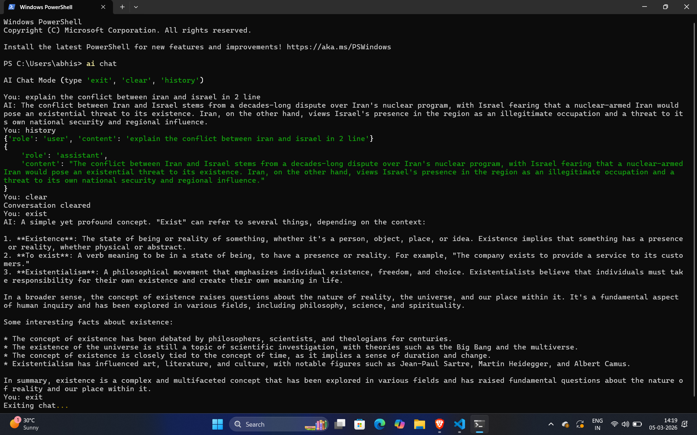

# AI Assistant CLI

Terminal-based AI developer assistant powered by LLMs.

A lightweight CLI tool that brings AI directly into your terminal for coding, debugging, summarizing files, and generating commands.

---

## Features

* AI Chat Mode
* Code Generator
* Code Explanation
* File Summarizer (TXT / PDF)
* CLI Command Generator
* Git Commit Message Generator
* Streaming Responses
* Groq API Support
* Ollama Offline Fallback

---

## Installation

```bash
pip install ai-assistant-cli
```

---

## Setup API Key

```bash
ai api-set YOUR_GROQ_API_KEY
```

---

## Usage

Ask a question:

```bash
ai ask "what is machine learning"
```

Chat mode:

```bash
ai chat
```


Generate code:

```bash
ai code "python script to scrape a website"
```

Summarize file:

```bash
ai summarize notes.txt
```

Explain code:

```bash
ai explain "for i in range(10): print(i)"
```

Generate CLI command:

```bash
ai cmd "create python virtual environment"
```

Generate Git commit message:

```bash
git add .
ai gitmsg
```

---

## Project Structure

```
ai-assistant-cli
│
├── ai_cli
│   ├── cli.py
│   ├── ai_engine.py
│   ├── config.py
│   └── memory.py
│
└── setup.py
```

---

## License

MIT License


